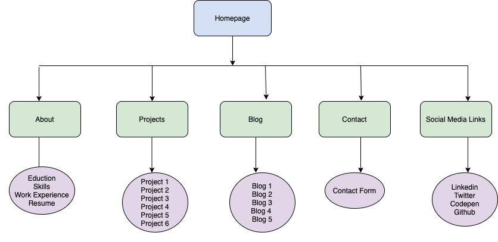
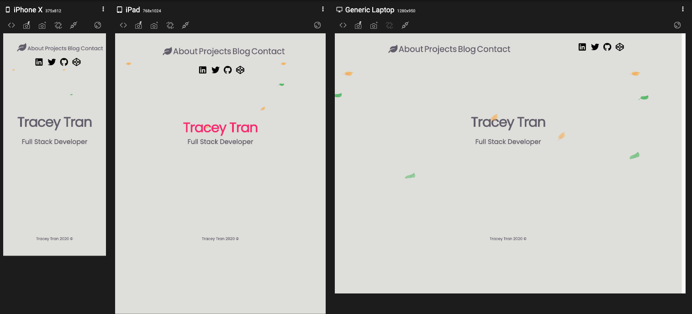
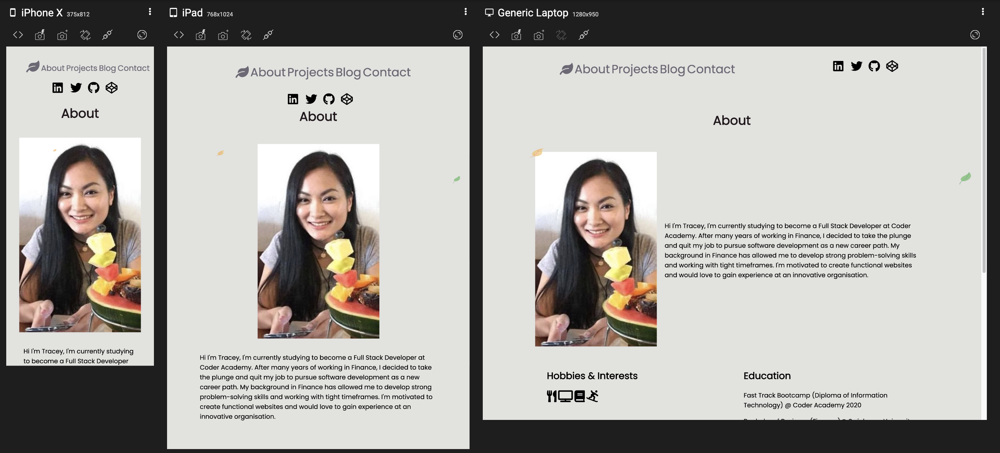
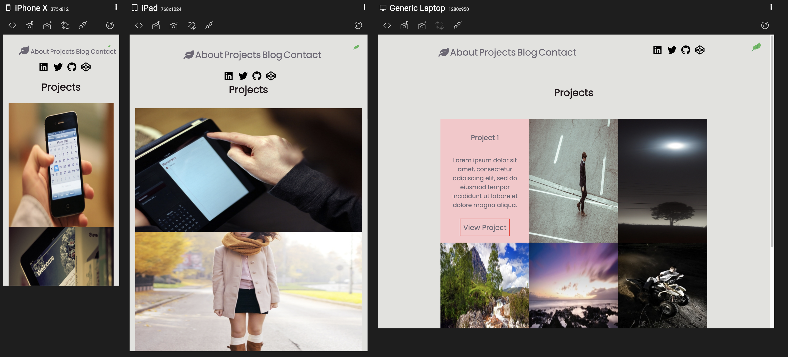
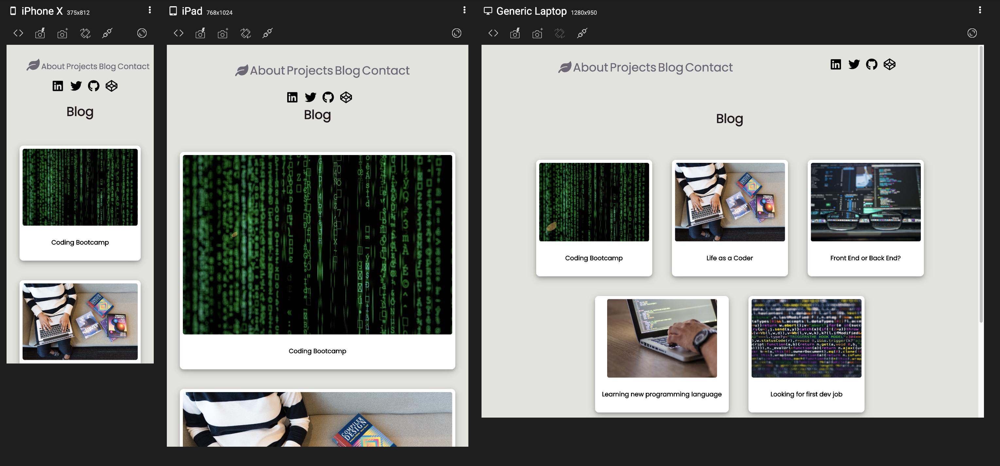
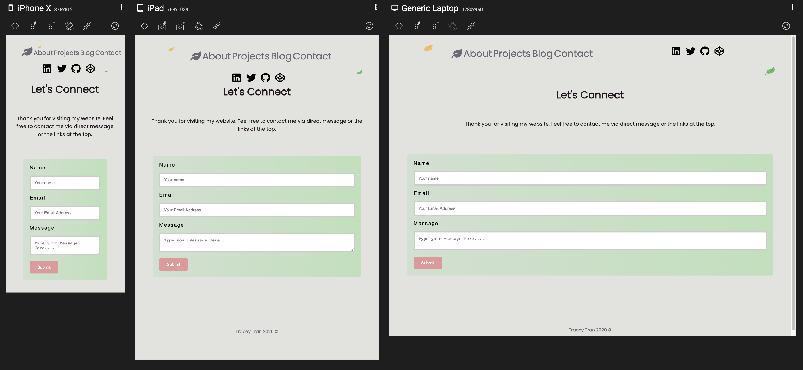

# Portfolio Website

 ## Table of Contents:  
[1. Links](#Links)  
[2. Purpose](#Purpose)  
[3. Functionality and Features](#Functionality-and-Features)  
[4. Sitemap](#Sitemap)  
[5. Screenshots](#Screenshots)  
[6. Target Audience](#Target-audience)  
[7. Tech Stack](#Tech-Stack)  

## Links

Portfolio URL deployed on Netlify [here](https://traceytran.netlify.app/)

Ed Workspace [here](https://edstem.org/courses/4464/workspaces/pgglIDEw8dv1I8doROi4aS5Fxs1gtm7c)

## Purpose

The purpose of this portfolio website is to showcase to potential employers my skills and abilities as a Full Stack Developer. 

The website contains information about me, projects that I've completed, blog pages that I have written and a contact form for clients to contact me and to connect with me via social media links. 

## Functionality and Features

* Responsive Layouts on Mobile, Desktop and Tablet
* Links open to an external browser to allow the users to stay on my site
* Nav bars on all the pages to allow easy access to different section
* Leaf animation used to create the wow factor on the landing page also serve as a common theme across all the pages
* Hover effect used on the homepage and nav bars and project cars
* Contact form
* Social Media icons on all pages to connect online

## Sitemap

## Screenshots

### Homepage

### About

### Project

### Blog

### Contact

## Target Audience

The target audience for this portfolio website are potential employers could be someone in HR or Senior Developer looking to hire the next developer. And could be for a client who is looking for a freelance developer.

## Tech Stack

Below are the list of the techology I used to create this website:

* Balsamiq (wireframing)
* Drawio (sitemap)
* Git (version control)
* HTML (main structure for all the pages)
* Terminal 
* CSS (styling responsive)
* Github (remote version control)
* Google Fonts
* Responsively.app (check responsiveness/screenshots)
* Pexels (images)
* Font Icons (icons)
* Font Awesome (icons)
